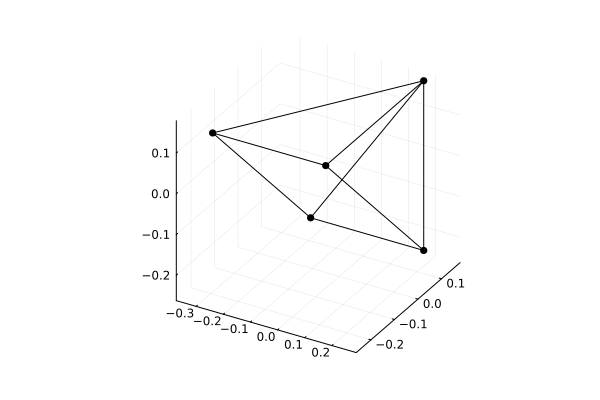

## Usage example:

The adjacency matrix files (like `graph_442.mat`) can be downloaded from [The House of Graphs](https://houseofgraphs.org/).

**Be aware that the brute force algorithms are exponential, up to n ≈ 16 is reasonable.**

```
julia> include("./src/spectral_drawing_utils.jl");

julia> A = readdlm("./data/graph_442.mat", Int64);

julia> G = SimpleGraph(A);

julia> bG, bX = b_VectorsBruteForce(G);

julia> bG
1.6666666666666665

julia> bX
5×8 Matrix{Float64}:
 -0.25      -0.25       0.166667   0.166667  -0.166667  -0.166667   0.25       0.25
 -0.25       0.166667  -0.25       0.166667  -0.166667   0.25      -0.166667   0.25
  0.166667  -0.25       0.166667  -0.25       0.25      -0.166667   0.25      -0.166667
  0.166667   0.166667  -0.25      -0.25       0.25       0.25      -0.166667  -0.166667
  0.166667   0.166667   0.166667   0.166667  -0.166667  -0.166667  -0.166667  -0.166667

julia> k = rank(bX)
3

julia> fig = plot(); GraphVectsPlot(G,bX[:,1:3]);

julia> savefig(fig,"./out/L1SD_graph_442.png")
```




| id    | Name               | b(G)    | size(bX) | rank(bX) | B(G)    | size(BX)   | rank(BX) |
|-------|--------------------|---------|----------|----------|---------|------------|----------|
|       | P_2                | 1.0     | (2, 2)   | 1        | 1.0     | (2, 2)     | 1        |
|       | P_3                | 0.75    | (3, 4)   | 2        | 1.5     | (3, 6)     | 2        |
|       | P_4                | 0.5     | (4, 2)   | 1        | 2.0     | (4, 2)     | 1        | 
|       | P_5                | 0.41667 | (5, 4)   | 2        | 2.0     | (5, 8)     | 2        | 
|       | P_6                | 0.33333 | (6, 2)   | 1        | 2.0     | (6, 26)    | 3        |
|       | P_7                | 0.29167 | (7, 4)   | 2        | 2.0     | (7, 74)    | 4        | 
|       | P_8                | 0.25    | (8, 2)   | 1        | 2.0     | (8, 198)   | 5        |
|       | P_9                | 0.225   | (9, 4)   | 2        | 2.0     | (9, 510)   | 6        |
| | | | | | | | |
|       | C_3                | 1.5     | (3, 6)   | 2        | 2.0     | (3, 6)     | 2        |
|       | C_4                | 1.0     | (4, 4)   | 2        | 2.0     | (4, 22)    | 3        | 
|       | C_5                | 0.83333 | (5, 10)  | 4        | 2.0     | (5, 60)    | 4        | 
|       | C_6                | 0.66667 | (6, 6)   | 3        | 2.0     | (6, 164)   | 5        | 
|       | C_7                | 0.58333 | (7, 14)  | 6        | 2.0     | (7, 420)   | 6        | 
|       | C_8                | 0.5     | (8, 8)   | 4        | 2.0     | (8, 1062)  | 7        | 
|       | C_9                | 0.45    | (9, 18)  | 8        | 2.0     | (9, 2634)  | 8        |
| | | | | | | | |
|       | K_{1,1}            | 1.0     | (2, 2)   | 1        | 1.0     | (2, 2)     | 1        |
|       | K_{1,2}            | 0.75    | (3, 4)   | 2        | 1.5     | (3, 6)     | 2        | 
|       | K_{1,3}            | 0.66667 | (4, 6)   | 3        | 2.0     | (4, 14)    | 3        | 
|       | K_{1,4}            | 0.625   | (5, 8)   | 4        | 2.5     | (5, 30)    | 4        | 
|       | K_{1,5}            | 0.6     | (6, 10)  | 5        | 3.0     | (6, 62)    | 5        | 
|       | K_{1,6}            | 0.58333 | (7, 12)  | 6        | 3.5     | (7, 126)   | 6        | 
|       | K_{1,7}            | 0.57143 | (8, 14)  | 7        | 4.0     | (8, 254)   | 7        | 
|       | K_{1,8}            | 0.5625  | (9, 16)  | 8        | 4.5     | (9, 510)   | 8        | 
| | | | | | | | |
|       | K_{2,2}            | 1.0     | (4, 4)   | 2        | 2.0     | (4, 22)    | 3        | 
| 264   | K_{2,3}            | 1.25    | (5,18)   | 4        | 3.0     | (5, 2)     | 1        |
| 812   | K_{2,4}            | 1.2     | (6, 8)   | 4        | 4.0     | (6, 2)     | 1        | 
| 866   | K_{2,5}            | 1.16667 | (7, 10)  | 5        | 5.0     | (7, 2)     | 1        | 
| 53673 | K_{2,6}            | 1.14286 | (8, 12)  | 6        | 6.0     | (8, 2)     | 1        | 
| 53008 | K_{2,7}            | 1.125   | (9, 14)  | 7        | 7.0     | (9, 2)     | 1        |
| | | | | | | | |
| 84    | K_{3,3}            | 1.5     | (6,18)   | 4        | 3.0     | (6, 122)   | 5        |
| 466   | K_{3,4}            | 1.75    | (7, 68)  | 6        | 4.0     | (7, 12)    | 2        |  
| 53886 | K_{3,5}            | 1.71429 | (8, 10)  | 5        | 5.0     | (8, 12)    | 2        | 
| 53887 | K_{3,6}            | 1.6875  | (9, 12)  | 6        | 6.0     | (9, 12)    | 2        |
| | | | | | | | |
| 74    | W_4                | 2.0     | (4, 14)  | 3        | 3.0     | (4, 12)    | 3        |
| 442   | W_5                | 1.66667 | (5,8)    | 3        | 3.5     | (5, 12)    | 4        |
| 204   | W_6                | 1.5     | (6, 10)  | 5        | 4.0     | (6, 20)    | 5        |
| 21252 | W_7                | 1.4     | (7, 12)  | 5        | 4.5     | (7, 34)    | 6        |
| 20709 | W_8                | 1.33333 | (8, 14)  | 7        | 5.0     | (8, 56)    | 7        |
| 53172 | W_9                | 1.25    | (9, 16)  | 8        | 5.5     | (9, 92)    | 8        |
| | | | | | | | |
| 74    | K_4                | 2.0     | (4, 14)  | 3        | 3.0     | (4, 12)    | 3        |
| 462   | K_5                | 2.5     | (5,30)   | 4        | 4.0     | (5, 20)    | 4        |
|       | K_6                | 3.0     | (6, 62)  | 5        | 5.0     | (6, 30)    | 5        |
|       | K_7                | 3.5     | (7, 126) | 6        | 6.0     | (7, 42)    | 6        |
|       | K_8                | 4.0     | (8, 254) | 7        | 7.0     | (8, 56)    | 7        |
|       | K_9                | 4.5     | (9, 510) | 8        | 8.0     | (9, 72)    | 8        |
| | | | | | | | |
| 74    | Tetrahedral Graph  | 2.0     | (4, 14)  | 3        | 3.0     | (4, 12)    | 3        |
| 226   | Octahedral Graph   | 2.0     | (6, 8)   | 3        | 4.0     | (6, 60)    | 5        |
| 1022  | Cubical Graph      | 1.0     | (8, 6)   | 3        | 3.0     | (8, 674)   | 7        |
| 1043  | Dodecahedral Graph |         |          |          |         |            |          |
| 1186  | Icosahedral Graph  | 1.66667 | (12,12)  | 6        | 5.0     | (12, 3152) | 11       |
